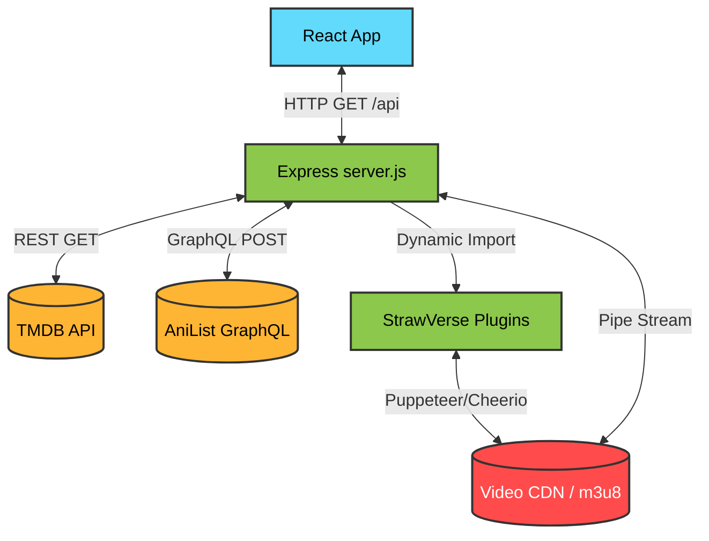

<div align="center">
  
  
  <p><strong>A full-stack streaming application that aggregates metadata and proxies video streams.</strong></p>
  
  <p>
    
    
    
    
  </p>
</div>

---

## Overview

MIYO-STREAM is a React and Express-based application that acts as a front-end interface for querying TMDB and AniList, while the Node.js backend handles the actual data fetching to prevent CORS issues and hide API keys. For anime playback, we avoid embedding iframes by scraping video hosters on the backend and proxying the resulting HLS (`.m3u8`) streams directly to the client.

A lot of the anime scraping logic is based on [StrawVerse](https://github.com/TheYogMehta/StrawVerse). We use their extension architecture to extract source URLs from providers and route the HTTP traffic through our Express server, which allows the native HTML5 player to consume the video chunks without running into cross-origin restrictions.

---

## Core Mechanics

- **Metadata Aggregation**: We hit the TMDB REST API for movies and TV shows, and the AniList GraphQL endpoint for anime and manga data. The Express server caches the AniList GraphQL responses to disk (`.cache/anilist`) using md5 hashes of the request body to reduce rate limiting.
- **Native HLS Proxying**: Instead of relying on third-party iframes for anime, the `server.js` backend executes scraping plugins (located in `extensions/Anime`). When a source `.m3u8` playlist is found, the `/api/proxy` endpoint intercepts the file, parses the text, and rewrites all the `.ts` segment URIs to point back to our own proxy endpoint. 
- **Referer Spoofing**: Since many video CDNs block requests missing the correct HTTP Referer, the proxy endpoint dynamically attaches the required referer headers based on the target domain (e.g., spoofing `https://kwik.cx/` when requesting chunks from `owocdn.top`).
- **Cloudflare Tunnel Integration**: If you are running this on a game server panel (like Pterodactyl) where you can't easily set up an Nginx reverse proxy with SSL, `server.js` can spawn a `cloudflared` child process on startup. Passing a `CF_TOKEN` in the `.env` file initiates a secure tunnel to Cloudflare's edge network, exposing the local Express port to a public HTTPS domain.

---

## Tech Stack

The following modules form the core architecture of the application.

### Frontend
| Module | Purpose in this Project |
| :--- | :--- |
| **React 18** | Core library for constructing the UI and managing component state. |
| **Vite** | Development server and production bundler. Compiles the React code and handles hot-module replacement. |
| **React Router** | Manages client-side routing, enabling navigation between the Home, Browse, and Detail views without full page reloads. |
| **Tailwind CSS** | Utility-first CSS framework used for all styling, ensuring the interface is fully responsive. |
| **HLS.js** | Client-side video player library. Parses the proxied `.m3u8` playlists and feeds the `.ts` video chunks into the HTML5 video element. |

### Backend
| Module | Purpose in this Project |
| :--- | :--- |
| **Express** | Node.js web framework. Serves the static React build in production, handles the `/api` routes, and proxies video streams. |
| **Axios** | HTTP client used to request metadata from TMDB/AniList and fetch video chunks from remote CDNs. |
| **Cheerio** | HTML parser used by the anime scraper extensions to extract video source URLs from raw DOM structures. |

---

## Architecture Diagram

The flow of requests between the client, our proxy server, and the external APIs and video CDNs:



---

## Directory Layout

```text
MIYO-STREAM/
├── server.js                 # The Express application. Handles API routes, proxying, caching, and cloudflared.
├── extensions/               # JavaScript plugins for scraping anime video sources.
├── src/
│   ├── components/           # React components (UI elements, layout, video player).
│   ├── context/              # React context for global state (e.g., Device Context).
│   ├── hooks/                # Custom hooks (e.g., SEO management).
│   ├── lib/                  # Helper functions for making API calls to the local Express server.
│   └── pages/                # Route-level React components.
├── .env.example              # Environment variable template.
└── package.json              # Dependencies and build scripts.
```

---

## Setup & Execution

### Requirements
- Node.js (v18 or higher recommended)
- A TMDB API key

### Instructions

1. **Clone the repository:**
   ```bash
   git clone https://github.com/cyber-winner/MIYO-STREAM.git
   cd MIYO-STREAM
   ```

2. **Install node modules:**
   ```bash
   npm install
   ```

3. **Configure environment variables:**
   Copy the example file to `.env`:
   ```bash
   cp .env.example .env
   ```
   Edit `.env` to include:
   - `TMDB_API_KEY`: Your key from The Movie Database.
   - `CF_TOKEN`: (Optional) Your Cloudflare Tunnel token.
   - `PORT`: Local port for the Express server to listen on (defaults to 3000).

4. **Start the development servers:**
   This runs both the Express backend and the Vite frontend simultaneously using `concurrently`:
   ```bash
   npm run dev
   ```
   The React app runs on `http://localhost:5173`, and API calls are proxied to the backend.

5. **Build for production:**
   ```bash
   npm run build
   ```
   This compiles the React code into the `dist/` directory. Running `npm start` or `node server.js` will serve these static files from Express while continuing to handle the API routes.

---

## Cloudflare Tunnel Setup (Optional)

If you need to expose the local Node process to the internet with an SSL certificate, you can configure Cloudflare Zero Trust. This setup is entirely optional and is only necessary if you are hosting on restricted environments (like game server panels) without native HTTPS.
1. In the Cloudflare Zero Trust Dashboard, navigate to Networks > Tunnels.
2. Create a `cloudflared` tunnel.
3. Cloudflare will give you an installation command. Look for the `--token` argument and copy the long string following it.
4. Put that string in your `.env` file as `CF_TOKEN=your_token_here`.
5. Map a Public Hostname to `http://localhost:3000` (or whatever `PORT` you configured).
6. When you execute `node server.js` (or `npm start`), the script checks for `CF_TOKEN` and uses `child_process.exec` to run `npx --yes cloudflared tunnel run`.

---

## Contributing

1. Fork the repo.
2. If you are adding a new data source, put the fetching logic in `server.js` or create a new plugin in the `extensions/` directory. Do not put API keys in the React code.
3. Open a Pull Request explaining the technical changes you made.

Refer to [CONTRIBUTING.md](CONTRIBUTING.md) for more specifics.

---

## License

MIT License. See [LICENSE](LICENSE).

<div align="center">
  <p>Made with ❤️ by the MIYO-STREAM community.</p>
</div>
